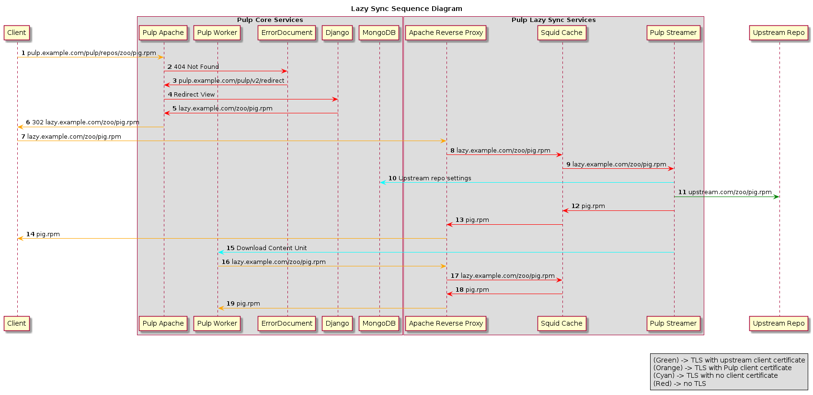

Lazy Content Loading Design
===========================

This section discusses the details of the the lazy content loading services and how they
integrate with Pulp's core services.

Sequence Diagram
----------------

The following sequence diagram provides a more detailed view of how the services interact
than the component diagram above:

#. The client requests a content unit from Pulp, just as it would without lazy content
   loading. This includes potentially offering a client certificate for content entitlement.

#. First, the validity of the client certificate is checked. If it is not valid, Apache returns
   403 Permission Denied. If the content has already been lazily fetched and saved in Pulp,
   the content is served to the client. Otherwise, a HTTP 404 Not Found occurs and Apache makes
   use of the ErrorDocument directive in the Apache configuration file.

#. The ErrorDocument directive redirects to ``/pulp/v2/redirect``, which corresponds to a Django
   view.

#. The Django view is invoked by Apache. This method determines if the requested content unit
   is part of a repository configured to use lazy content loading.

#. If the content unit is a part of a lazy-loaded repository, the Django view determines the
   location of the lazy content loading services using Pulp's ``server.conf`` and rewrites the
   URL with the location and returns this to Apache. If it is not a part of a repository, the
   view directs Apache to return a HTTP 404 Not Found.

#. The Apache server returns a 302 Redirect with the rewritten URL or a 404 Not Found.

#. The client makes a new request to the redirect location, which is handled by the Apache
   reverse proxy. This request includes the same client certificate for content entitlement
   and the entitlement certificate is validated again. The TLS connection from the client is
   terminated.

#. The Apache reverse proxy forwards the plaintext request to Squid.

#. Squid forwards the plaintext request to the Pulp streamer. Duplicate requests for the same
   content unit are not forwarded to the Pulp streamer. Instead, Squid will use the first
   request to satisfy all further requests.

#. The Pulp Streamer contacts the Pulp database to determine how and where to download the
   requested content. This includes the upstream repository URL and any client certificates
   used for entitlement.

#. The Pulp Streamer initiates the download from the upstream repository with the correct
   settings and streams the content to Squid as it receives it.

#. Squid caches the content as streams the content back to Apache. This cache is used to service
   any further requests for that content unit.

#. Apache streams the content back to the client.

#. The Pulp Streamer dispatches a Pulp task which downloads the newly cached content unit.

#. A Pulp worker initiates a request to the Apache reverse proxy for the newly cached content
   unit just as the original client did.

#. The Apache reverse proxy terminates the TLS connection and forwards the request to Squid.

#. Squid uses its cache to service the request.

#. Apache streams the content back to the Pulp worker, which saves the content unit.

Once a content unit has been saved by the Pulp core services, it is served directly to clients
without invoking the lazy content loading services.

