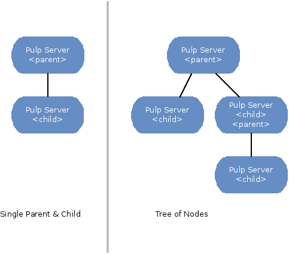
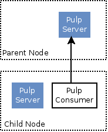

Nodes
=====

Overview
--------

The *Pulp Nodes* concept describes the relationship between two Pulp servers for the purpose of
sharing content.  In this relationship, one is designated the *parent* and the other is designated
the *child*.  The *child* node consumes content that is provided by the *parent* node.
It is important to understand that a child :term:`node` is a complete and fully functional Pulp
server capable of operating autonomously.

The following terms are used when discussing *Nodes*:

  node
    A Pulp server that has the *Nodes* support installed and has a content sharing
    relationship to another Pulp server.

  parent node
    A Pulp node that provides content to another Pulp server that has been registered
    as a :term:`consumer`.

  child node
    A Pulp node that consumes content from another Pulp server.  The child node must be
    registered as a consumer to the parent and been activated as a child node.

  node activation
    The designation of a registered consumer as a child node.

  enabled repository
    A Pulp repository that has been *enabled* for :term:`binding` by a child node.

Node Topologies
^^^^^^^^^^^^^^^

Pulp nodes may be related to form tree structures.  Intermediate nodes may be designated
as both a parent and child node.

Node Anatomy
^^^^^^^^^^^^

The anatomy of both parent and child nodes is simple.  Parent nodes are Pulp servers
that have the *Nodes* support installed.  A Child node is a Pulp server with both the *Nodes*
and *Consumer* support installed.

Installation
------------

