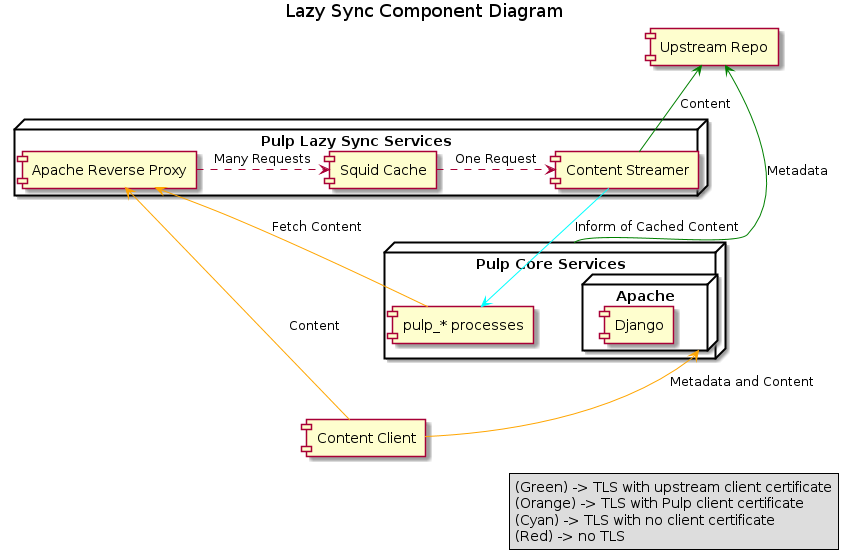

Alternate Download Policies
===========================

Pulp supports several methods for downloading the :term:`content units <content unit>` in
a :term:`repositories <repository>`. These methods are referred to as
:term:`download policies <download policy>`. By default, Pulp uses the
:term:`immediate download policy <immediate download policy>` to download content. To use
an alternate download policy, several services need to be installed and configured. The
advantage of using an alternate download policy is that it allows Pulp to serve clients or
copy content between repositories without downloading every :term:`content unit <content unit>`
first. When a repository is created, its download policy can be set.

.. note::

    Not all content types have repository metadata, which is required when using any of the
    :term:`deferred download policies <deferred download policies>`. Therefore, some content
    types are limited to the default :term:`immediate download policy`.

Overview of Deferred Downloading Components
-------------------------------------------
The diagram below provides a high-level overview of how the deferred download services interact
with the Pulp core services.

Deferred downloading relies on three services:

* ``httpd`` - The Apache web server acts as a TLS termination point and reverse proxy.
  This service handles the incoming client requests and forwards them to Squid.

* ``squid`` - The Squid process caches content and de-duplicates client requests so that
  the content is only downloaded one time.

* ``pulp-streamer`` - The pulp-streamer process interacts with Pulp's core services to determine
  where the content is located and how to download it. It streams the content back to the client
  through Squid and Apache as it is downloaded.

Clients request the :term:`content unit` from Pulp's core services. If the content has not been
downloaded, Pulp redirects the client to the Apache reverse proxy. Once the content has
been downloaded, Pulp is informed that a new content unit has been downloaded and cached
by Squid. At regular intervals, Pulp fetches the cached content and saves it so that when
a client next requests it, Pulp can serve it directly.

Installation
------------
The deferred downloading services can be installed using the ``pulp-lazy`` package group::

 $ sudo yum groupinstall pulp-lazy

Ensure that ``httpd``, ``squid``, and ``pulp-streamer`` are running and enabled to start at boot.

Configuration
-------------

In addition to configuring the services listed above, alternate download policies must be
enabled in the Pulp server configuration. This is located by default in ``/etc/pulp/server.conf``
and is documented inline. All relevant settings are contained in the ``deferred_downloads``
section.

Once the Pulp server is configured, the Apache reverse proxy, Squid, and the Pulp streamer
require configuration. A default configuration for Apache is provided by the
``python-pulp-streamer`` package and documentation can be found inline. Squid requires more
configuration which is up to the user. However, the following is a basic configuration with
inline documentation::

 # Recommended minimum configuration. It is important to note that order
 # matters in Squid's configuration; the configuration is applied top to bottom.

  # Listen on port 3128 in Accelerator (caching) mode.
  http_port 3128 accel

  # Only accept connections from the local host. If the Apache reverse
  # proxy is running on a different host, adjust this accordingly.
  http_access allow localhost

  # Allow requests with a destination that matches the port squid
  # listens on, and deny everything else. This is okay because we
  # only handle requests from the Apache reverse proxy.
  acl Safe_ports port 3128
  http_access deny !Safe_ports

  # Only allow cachemgr access from localhost
  http_access allow localhost manager
  http_access deny manager

  # We strongly recommend the following be uncommented to protect innocent
  # web applications running on the proxy server who think the only
  # one who can access services on "localhost" is a local user
  http_access deny to_localhost

  # And finally deny all other access to this proxy
  http_access deny all

  # Forward requests to the Pulp Streamer. Note that the port configured here
  # must match the port the Pulp Streamer is listening on. The format for
  # entries is: cache_peer hostname type http-port icp-port [options]
  #
  # The following options are set:
  #  * no-digest: Disable request of cache digests, as the Pulp Streamer does not
  #               provide one
  #  * no-query: Disable ICP queries to the Pulp Streamer.
  #  * originserver: Causes the Pulp Streamer to be contacted as the origin server.
  #  * name: Unique name for the peer. Used to reference the peer in other directives.
  cache_peer localhost parent 8751 0 no-digest no-query originserver name=PulpStreamer

  # Allow all queries to be forwarded to the Pulp Streamer.
  cache_peer_access PulpStreamer allow all

  # Ensure all requests are allowed to be cached.
  cache allow all

  # Set the debugging level. The format is 'section,level'.
  # Valid levels are 1 to 9, with 9 being the most verbose.
  debug_options ALL,1

  # Set the minimum object size to 0 kB so all content is cached.
  minimum_object_size 0 kB

  # Set the maximum object size that can be cached. Default is to support DVD-sized
  # objects so that ISOs are cached.
  maximum_object_size 5 GB

  # Sets an upper limit on how far (number of bytes) into the file
  # a Range request may be to cause Squid to prefetch the whole file.
  # If beyond this limit, Squid forwards the Range request as it is and
  # the result is NOT cached.
  #
  # A value of 'none' causes Squid to always prefetch the entire file.
  # This is desirable in all cases for Pulp and is required to Kickstart
  # from repositories using deferred download policies.
  range_offset_limit none

  # Objects larger than this size will not be kept in the memory cache. This should
  # be set low enough to avoid large objects taking up all the memory cache, but
  # high enough to avoid repeatedly reading hot objects from disk.
  maximum_object_size_in_memory 100 MB

  # Set the location and size of the disk cache. Format is:
  # cache_dir type Directory-Name Fs-specific-data [options]
  #
  # * type specifies the type of storage system to use.
  # * Directory-Name is the top-level directory where cache swap files will be stored.
  #   Squid will not create this directory so it must exist and be writable by the
  #   Squid process.
  # * Fs-specific-config varies by storage system type. For 'aufs' and 'ufs' the data
  #   is in the format: Mbytes L1 L2.
  #     - Mbytes is the number of megabytes to use in this cache directory. Note that
  #       that this should never exceed 80% of the storage space in that directory.
  #     - L1 is the number of first-level subdirectories which are created under the
  #       root cache directory (Directory-Name).
  #     - L2 is the number of second-level subdirectories which will be created under
  #       each L1 subdirectory.
  #
  # Be aware that this directive must NOT precede the 'workers' configuration option
  # and should use configuration macros or conditionals to give each squid worker that
  # requires a disk cache a dedicated cache directory.
  #
  # 'aufs' uses layered directories to store files, utilizing POSIX-threads to avoid
  # blocking the main Squid process on disk-I/O. This was formerly known in Squid
  # as async-io.
  #
  # 'ufs' is simple to set up and available in all recent version of Squid,
  # but should not be used in a production environment. 'ufs' does not make use of
  # threads for I/O, so it blocks when reading from or writing to the cache.
  #
  # 'rock' uses a database-style storage. All cached entries are stored in a
  # 'database' file, using fixed-size slots. A single entry occupies one or more
  # slots. 'rock' performs best with small files, whereas 'aufs' works best with
  # larger files. A combination of the two can be used in advanced deployments.
  cache_dir aufs /var/spool/squid 10000 16 256

  # Leave coredumps in the first cache dir
  coredump_dir /var/spool/squid

  #
  # Define how long objects without a explicit expiry time are considered fresh.
  # All responses from the Pulp Streamer should enclude a max-age, but this is
  # a way to ensure all objects become stale eventually.
  #
  # Add any of your own refresh_pattern entries above these.
  #
  refresh_pattern ^ftp:		1440	20%	10080
  refresh_pattern ^gopher:	1440	0%	1440
  refresh_pattern -i (/cgi-bin/|\?) 0	0%	0
  refresh_pattern .		0	20%	4320

For more information about a configuration option, please consult the Squid documentation.

Finally, the Pulp streamer has several configuration options available in its configuration
file, found by default in ``/etc/pulp/streamer.conf``.

Pulp-admin Usage
----------------
Once deferred downloading components have been configured, you can create repositories that
use :term:`deferred download policies <deferred download policies>`:

::

  $ pulp-admin rpm repo create --help
  Download Policy
  --download-policy - content downloading policy (immediate | background |
                      on_demand)

  $ pulp-admin rpm repo create --repo-id=zoo --download-policy=on_demand \
  --feed=https://repos.fedorapeople.org/repos/pulp/pulp/demo_repos/zoo/
  $ pulp-admin rpm repo sync run --repo-id=zoo

Both on-demand and background download policies allow you to manipulate the repository after
a sync is complete.

On-demand Download Repositories
^^^^^^^^^^^^^^^^^^^^^^^^^^^^^^^
This will configure the repository to skip downloading files during syncs. Once a sync and
publish has completed, the repository is ready to serve content to clients even though no
content has been downloaded yet. When a client requests a file, such as an RPM, Pulp will
perform the download from the upstream zoo repository and serve that file to the client.
It will then save the file for any other clients that request that file.

Background Download Repositories
^^^^^^^^^^^^^^^^^^^^^^^^^^^^^^^^
This will configure the repository to skip downloading files during a sync, but once a sync
has been completed it will dispatch a task to download all the files. This is equivalent to
running:

::

  $ pulp-admin rpm repo create --repo-id=zoo --download-policy=on_demand \
  --feed=https://repos.fedorapeople.org/repos/pulp/pulp/demo_repos/zoo/
  $ pulp-admin rpm repo sync run --repo-id=zoo
  $ pulp-admin repo download --repo-id=zoo

Deferred Downloading with Alternate Content Sources
---------------------------------------------------
:doc:`Alternate Content Sources <content-sources>` can be used in conjunction with deferred
downloading.

.. note::
    If the alternate content source is configured to have a ``file://`` base URL, that URL
    must be valid for the host running ``pulp_streamer``. If ``pulp_streamer`` is running
    on a different host than the core Pulp services, the ``pulp_streamer`` host should have
    access to both the Content Sources configuration directory and the ``file://`` URL.
