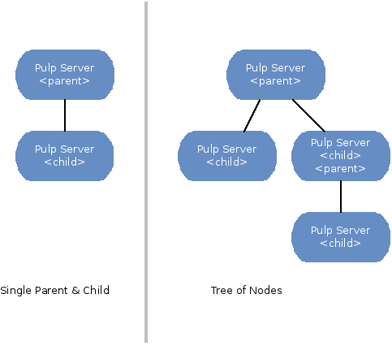
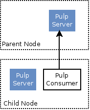

.. _pulp_nodes:

Nodes
=====

Overview
--------

The *Pulp Nodes* concept describes the relationship between two Pulp servers for the purpose of
sharing content. In this relationship, one is designated the *parent* and the other is designated
the *child*. The *child* node consumes content that is provided by the *parent* node.
It is important to understand that a child :term:`node` is a complete and fully functional Pulp
server capable of operating autonomously.

The following terms are used when discussing *Nodes*:

.. glossary::

  node
    A Pulp server that has the *Nodes* support installed and has a content sharing
    relationship to another Pulp server.

  parent node
    A Pulp node that provides content to another Pulp server that has been registered
    as a :term:`consumer` and activated as a node.

  child node
    A Pulp node that consumes content from another Pulp server. The child node must be
    registered as a consumer to the parent and been activated as a child node.

  node activation
    The designation of a registered consumer as a child node.

  enabled repository
    A Pulp repository that has been *enabled* for :term:`binding` by child nodes.

Node Topologies
^^^^^^^^^^^^^^^

Pulp nodes may be associated to form tree structures. Intermediate nodes may be designated
as both a parent and a child node.

Node Anatomy
^^^^^^^^^^^^

The anatomy of both parent and child nodes is simple. Parent nodes are Pulp servers
that have the *Nodes* support installed. A Child node is a Pulp server with both the *Nodes*
and *Consumer* support installed.

Authentication
--------------

The *child* node is authenticated to the *parent* node's REST API using Oauth.
The connection is SSL but no client certificate is required. The *parent* node publishes
content which is downloaded (as needed) by the *child* node using HTTPS requiring client
certificate that has been signed by the Pulp CA.

During installation of the *Nodes* packages, an x.509 certificate is generated and signed
using the Pulp CA (specified in server.conf) and stored in ``/etc/pkp/pulp/nodes/node.crt``.
The certificate is generated using ``/usr/bin/pulp-gen-nodes-certificate``, which is provided
by the *Nodes* packages.

The node private key and certificate are sent to the *child* node at the beginning of each
synchronization request to be used as the HTTPS credentials.

If the Pulp CA is changed after installation, administrators **must** regenerate the *Nodes*
certificate using *pulp-gen-nodes-certificate*.

Installation
------------

Since Pulp nodes *are* Pulp servers, the installation instructions for *Nodes* support
assumes that the :ref:`server installation <server_installation>` has been completed. Next,
follow the instructions below on each server depending on its intended role within the
node topology.

Parent
^^^^^^

To install *Nodes* parent support, follow the instructions below.

1. Install the node parent package group.

::

  $ sudo yum install @pulp-nodes-parent

2. The communication between the child and parent nodes is secured using OAuth. The parent node
   must have OAuth enabled and configured. Please see :ref:`OAuth <oauth-config>` for instructions
   on enabling and configuring OAuth.

3. Run ``pulp-manage-db``.

4. Restart :ref:`server components<server-components>`.

Child
^^^^^

To install *Nodes* child support, follow the instructions below.

1. Install the node child package group.

::

 $ sudo yum install @pulp-nodes-child

2. The communication between the child and parent nodes is secured using OAuth. The child node
   must have OAuth enabled and configured. Please see :ref:`OAuth <oauth-config>` for instructions
   on enabling and configuring OAuth.

::

 [oauth]
 enabled: true
 oauth_key: Xohkaethaama5eki
 oauth_secret: eePa7Bi3gohdir1pai2icohvaidai0io

.. warning::

   Do not use the key or secret given in the above example. It is important that you use unique and
   secret values for these configuration items.

3. Edit ``/etc/pulp/nodes.conf`` and set the parent OAuth *key* and *secret* to match values found
   in ``/etc/pulp/server.conf`` on the parent node. The *user_id* must be updated as needed to match
   a user with administration privileges on the parent node.

::

 [oauth]
 user_id:  <EDIT: admin user on parent node>

 [parent_oauth]
 key:      <EDIT: matching value from parent /etc/pulp/server.conf>
 secret:   <EDIT: matching value from parent /etc/pulp/server.conf>
 user_id:  <admin user on parent node>
 
Example:

::

 [oauth]
 user_id: admin

 [parent_oauth]
 key: Xohkaethaama5eki
 secret: eePa7Bi3gohdir1pai2icohvaidai0io
 user_id: admin

4. Run ``pulp-manage-db``.

5. Restart :ref:`server components<server-components>`.

6. Restart ``goferd``.

Admin Client Extensions
^^^^^^^^^^^^^^^^^^^^^^^

The admin extensions provide *Nodes* specific commands used to perform node administration
which includes the following:

 * Child node activation.
 * Child node deactivation.
 * List child nodes.
 * Enable repositories for node binding.
 * Disable repositories for node binding.
 * List enabled repositories.
 * Bind a child node to a repository.
 * Unbind a child node from a repository.
 * Initiate repository publishing of *Nodes* content.
 * Initiate child node synchronization.

Install the *Nodes* admin client extensions.

::

 $ sudo yum install pulp-nodes-admin-extensions

Enabling Repositories
---------------------

In Pulp *Nodes*, there is a concept of enabling and disabling repositories for use with child
nodes. Repositories must be *enabled* before being referenced in node bindings.

Repositories may be enabled using the admin client. See ``node repo`` commands for details.

::

 $ pulp-admin node repo enable --repo-id <repo-id>

::

 $ pulp-admin node repo disable --repo-id <repo-id>

Listing the enabled repositories can be done using the admin client. See: the ``node repo list``
for details.

::

 $ pulp-admin node repo list

.. _node_repository_publishing:

Repository Publishing
---------------------

After a repository has been enabled, it MUST be published before synchronizing content
to child nodes. Publishing a *Nodes* enabled repository generates the data necessary for
repository content synchronization with child nodes. If auto-publishing is enabled, a normal
repository synchronization will result in publishing this data as well.

The size of the published data varies based on the number of content units contained in the
repository and the amount of metadata included in each unit. Each published unit consists of a
copy of the metadata and a symlink to the actual file associated with the unit.  The metadata is
stored as gzip-compressed JSON.

The *Nodes* information can be manually published using the admin client.
See: the ``node repo publish`` for details.

::

 $ pulp-admin node repo publish --repo-id <repo-id>

Registration & Activation
-------------------------

Once the *Nodes* child support has been installed on a Pulp server, it can be registered to a
parent server. This is accomplished using the Pulp consumer client. As mentioned, a child
node is both a Pulp server and a consumer that is registered to the parent node.

On the child Pulp server:

1. Edit the ``/etc/pulp/consumer/consumer.conf`` file and set the ``host`` property the to the
   hostname or IP address of the Pulp server to be use as the child node's parent.

::

 [server]
 host = <parent hostname or IP>

2. Register to the parent server as a consumer. This command will prompt for a password.

::

 $ sudo pulp-consumer -u <user> register --consumer-id <id>

3. Active the Pulp server as a child node. See: the ``node activate`` command for details.

::

 $ sudo pulp-consumer node activate

.. _node_binding:

Binding To Repositories
-----------------------

The selection of content to be replicated to child nodes is defined by repository bindings.
Using the *Nodes* ``bind`` and ``unbind`` commands, users create an association between the
child node and *Nodes* enabled repositories.

Examples:

::

 $ pulp-admin node bind --node-id <node-id> --repo-id <repo-id>

::

 $ pulp-consumer node bind --repo-id <repo-id>

.. _node_synchronization:

Child Synchronization
---------------------

A child node's repositories and their content can be synchronized with the parent. Technically,
this action is seen by the parent as a content update on one of it's consumers. But, for most
users, the term synchronization is easier to grasp. During this process, the following objects
and properties are replicated to the child node:

* Repositories

 * description
 * notes

* Distributors

 * configuration (includes certificates and other credentials)

* Content Units

 * metadata
 * associated files (bits)

.. _node_strategies:

Strategies
^^^^^^^^^^

During child node synchronization, named strategies determine how the synchronization
is performed and what the desired effect will be. Strategies are incorporated at two levels
during node synchronization.

The first is the *node* level strategy which determines how the collection of repository objects are
synchronized. Depending on the selected strategy, repositories are created, updated or deleted
to match the set of repositories to which the node is associated through bindings.

The second is the *repository* level strategy which determines how each repository's content is
synchronized. Depending on the selected strategy, content units are created, updated or deleted
to match the content contained in the repository on the parent.

Current, there are two supported strategies.

 additive
   Results in objects present in the parent but not in the child being created or updated
   as necessary. This strategy should be used when objects created locally in the child
   should be preserved.

 mirror
   Results in objects present in the parent but not in the child being created or updated
   as necessary. Any objects present in the child that do not exist in the parent are removed.
   This strategy should be used when the desired effect of synchronization is for the child
   repositories to be an exact mirror of those on the parent.

The *node* level strategy is specified during node activation. Once activated, the strategy may
be changed by performing a node deactivation followed by node activation specifying the desired
strategy.

The *repository* level strategy is specified during node binding to a repository. Once bound, the
strategy may be changed by performing an unbind followed by a bind to the repository specifying the
desired strategy.

.. note:: The ``additive`` strategy is the default.

Running
^^^^^^^

The synchronization of a child node can be initiated using the admin client. This results in a
request being sent to the agent on the child node which performs the update. A *partial*
synchronization can be initiated by doing a regular repository synchronization on the child node.
This will synchronize only the content of the repository.

The synchronization can be requested using the admin client. See: the ``node sync`` command.

::

 $ pulp-admin node sync run --node-id <node-id>

Scheduling
^^^^^^^^^^

Synchronization of a particular child can be scheduled with an optional recurrence. The
format for describing the schedule follows the Pulp standard for
:ref:`date and time intervals <date-and-time>`. All commands related to the
creation, removal, and listing of node sync schedules can be found under the
``node sync schedules`` command.

.. _node_quick_start:

Quick Start
-----------

This assumes there are two Pulp servers up and running. The following steps could generally be
followed to get a basic *Nodes* parent and child setup going. To simplify the writeup, it's
assumed that the parent server's hostname is ``parent.redhat.com`` and it has a repository
named ``pulp-goodness`` that we want to share with our child.

On The Parent
^^^^^^^^^^^^^

On the Pulp server to be used as the parent node:

1. Install the pulp-nodes-parent package group.

::

  $ sudo yum install @pulp-nodes-parent
  $ sudo service httpd restart

2. Enable the ``pulp-goodness`` repository.

::

 $ pulp-admin node repo enable --repo-id pulp-goodness

3. Publish the ``pulp-goodness`` repository.

::

 $ pulp-admin node repo publish --repo-id pulp-goodness

On The Child
^^^^^^^^^^^^

On the Pulp server to be used as the child node:

1. Install the pulp-nodes-child package group.

::

  $ sudo yum install @pulp-nodes-child

2. Edit ``/etc/pulp/nodes.conf`` and set the parent OAuth *key* and *secret* to match values found in
   ``/etc/pulp/server.conf`` on the parent node.

::

 [parent_oauth]
 key:    <matching value from parent /etc/pulp/server.conf>
 secret: <matching value from parent /etc/pulp/server.conf>

3. Edit ``/etc/pulp/consumer/consumer.conf`` and change:

::

 [server]
 host = parent.redhat.com

4. Restart Apache.  For upstart::

     $ sudo service httpd restart

   For systemd::

     $sudo systemctl restart httpd

5. Restart the Pulp agent.  For upstart::

     $ sudo service goferd restart

   For systemd::

     $ sudo systemctl restart goferd

6. Register as a consumer. This command will prompt for a password.

::

 $ pulp-consumer register --consumer-id child-1

7. Activate the node.

::

 $ pulp-consumer node activate

8. Bind to the ``pulp-goodness`` repository.

::

 $ pulp-consumer node bind --repo-id pulp-goodness

Anywhere Using Admin Client
^^^^^^^^^^^^^^^^^^^^^^^^^^^

1. Synchronize the child.

::

 $ pulp-admin node sync run --node-id child-1

Tips & Troubleshooting
----------------------

1. Make sure httpd was restarted after installing *Nodes* packages on both the parent and child.
2. Make sure goferd was restarted after installing *Nodes* packages on the child.
3. Make sure that *Nodes* enabled repositories have been published.
4. Make sure that ALL plugins installed on the parent are installed on the child.
